<html lang="en">

<head>
<meta charset="UTF-8">
<meta http-equiv="X-UA-Compatible" content="IE=edge">
<meta name="viewport" content="width=device-width, initial-scale=1.0">
<title>Countries Development Clustering Unsupervised Machine Learning Project</title>

</head>

<body>

<h1>
Countries Development Clustering Unsupervised Machine Learning Project
</h1>

<h2>General Information About The Project: </h2>

<ul>

<li>The project is written in Python in a Jupyter Notebook format</li>
<li>The motivation behind the dataset is to produce a machine learning model that can categorize countries around the world based on their similarities </li> 
<li>The dataset behind the project is captured from HELP International, which is an international humanitarian NGO, and the data is available at the following link from kaggle.com <a
href="https://www.kaggle.com/datasets/rohan0301/unsupervised-learning-on-country-data"> Dataset Link
</a>  
<li>The purpose of the dataset is to be able to categorize countries effectively for aid distribution purposes. Therefore, according to the provider of the data we should be able to categorize the data based on their similarities in terms of development</li>

<li>The project initially starts by conducting EDA in preprocessing.ipynb file</li>
<li>The second part of the project takes Country-data.csv CSV file and conducts an ML analysis on the data in the main.ipynb file</li>
<li>Detailed work of preporcessing the data is available at <b>preprocessing.ipynb</b></li>
<li>Detailed work of applying each algorithm is available at <B>maincode.ipynb</B></li>

</ul>

<h2>EDA Conclusions Written Information: </h2>

<ul>
<li>There is a total of <b>7</b> features which are: </li>
<ul>
<li><b>country</b>, the name of the country </li>
<li><b>child_mort</b>, children (under the age of 5) mortality rate per 1000 births </li>
<li><b>exports</b>, the exports of goods and services per capita. It is given as a percentage of the total GDP per capita  </li>
<li><b>health</b>, the health spends per capita. It is given as a percentage of the total GDP per capita </li>
<li><b>imports</b>, the imports of goods and services per capita. It is given as a percentage of the total GDP per capita </li>
<li><b>income</b>, the total (net) income per person per country</li>
<li><b>inflation</b>, the inflation per country, which is measured as the annual growth rate of the total GDP </li>
<li><b>life_expec</b>, the life expectancy, which is given as the average number of year a new born child would live if the mortality rate patterns do not change from the current onesy </li>
<li><b>total_fer</b>, the total fertility, which is the number of children  that are born to each woman </li>
<li><b>gdpp</b>, The growth domestic product per person. This is calculated as the total GDP divided by the population</li>

</ul>

</ul>

<h2>EDA Scatter Plots: </h2>

<ul>

<li>A scatter plot between the child mortality rate and gdpp </li>
<ul>
<li>Poorer nations with lower gdpp have the highest child mortality rates and vice versa for the richer nations. The wealth of a nation is viewed in terms of gbpp</li>

   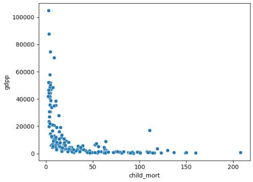   

</ul>

<li>A scatter plot between the exports and gdpp </li>
<ul>
<li>Majority of countries have exports below 100 per capita and gdpp below 60000, the wealth of a nation is viewed in terms of gbpp. 
Countries such as Timor-Leste have very low exports but a much better gdpp in comparision to the other countries in list. Therefore, exports alone might not be a direct indicator of countries development</li>

   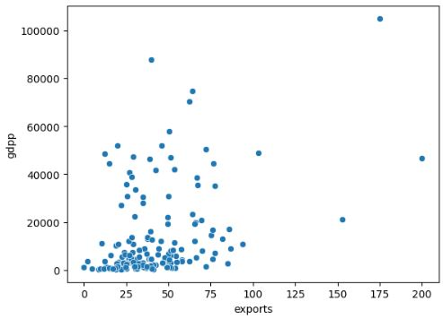   

</ul>

<li>A scatter plot between the imports and gdpp </li>
<ul>
<li>There seem to be a linear realtionship between imports and exports. Countries with low imports tend to have low exports per capita and vice versa. When, it comes to a countries development imports is not a good column to use, countries such as Brazil, Japan are in the list of countries with the lowest imports per capita which most likely is due to their population size.
Also, very developed counteies such as Luxembourg have one of the highest imports and it is due to their low population</li>

   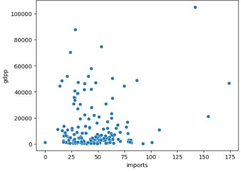   

</ul>

<li>A scatter plot between the health and gdpp </li>
<ul>
<li>Qatar is one of the wealthiest countries in the world and its in a list of least spenders when it comes to health. Therefore, health spendings is not the best indicator about a countries development. 
The most developed countries in the world namely  USA, Neatherlands, and France are in the top spenders when it comes to health. However, the same can be said about low gdpp countries such as Micronesia and Sierra Leone</li>

   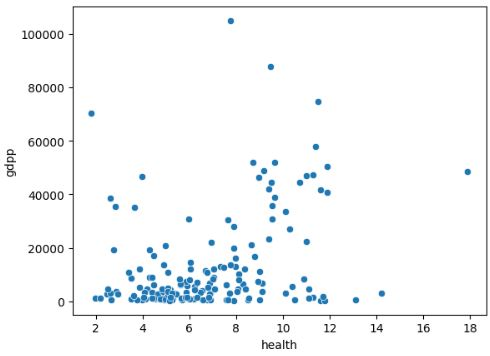   

</ul>

<li>A scatter plot between the net income per person and gdpp </li>
<ul>
<li>Income and gdpp are linearly correlated. Richer countries have high gdpp and vice versa</li>

   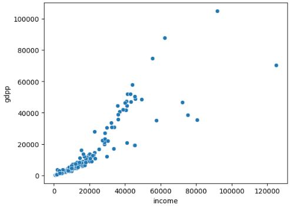   

</ul>

<li>A scatter plot between the inflation per country and gdpp </li>
<ul>
<li>Inflation is not a direct factor to represent the countries development. However, poorer countries tend to depends on richer countries and that impact their overall inflation. 
The list of countries with the lower inflation have higher gdpp than the list of countries with the highest inflation</li>

   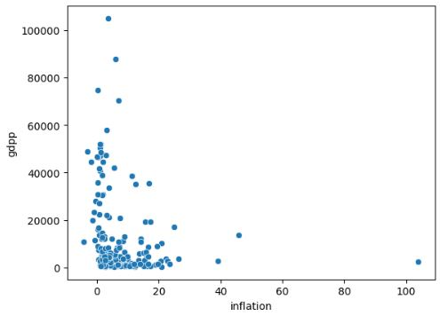   

</ul>

<li>A scatter plot between the life expetancy per country and gdpp </li>
<ul>
<li>More developed countries have a much higher life expetancy and vice versa</li>

   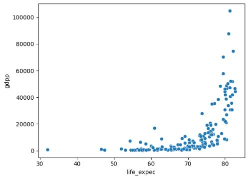   

</ul>           

<li>A scatter plot between the total fertility and gdpp </li>
<ul>
<li>More developed countries tend to have lower fertility rate and vice versa</li>

   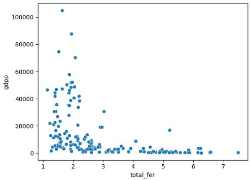   

</ul>     

<li>A scatter plot between the exports and imports </li>
<ul>
<li>Exports and imports seem to have a somehwat linear realtionship</li>

   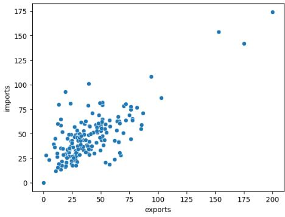   

</ul>  

<li>A scatter plot between the children mortality and total fertility</li>
<ul>
<li>Children mortality and total fertility seem to have a linear realtionship. Meaning countries that have higher rate of children mortality tend to have more children</li>

   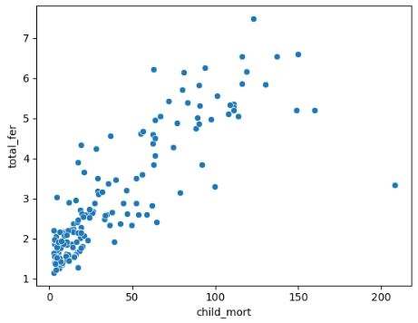   

</ul>  

<li>A scatter plot between children mortality and total life expetency</li>
<ul>
<li>Children mortality and life expectancy have a linear realtionship. Meaning due to the high mortality rate in some countries the life expency value decreases</li>

   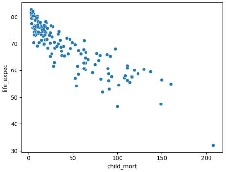   

</ul>  

</ul>

<h2>Conclusions: </h2>

<ul>
<li>      The K-Means Clustern Algorithm was able to categorize data based on the K value 
</li>
<li>      After conducting EDA the "Elbow Method" was used to analyze specific values of K. Namely K = 9 and K = 16
</li>
<li>      Both clusters resulted in clusters that contained countries of many similaries many GDPP and development status 
</li>

<li>     <b>   For K = 9:</b>
</li>
<ul> 
<li>    The world most in need countries including Afghanistan, Congo, Niger, etc. Happen to be in the same cluster. Cluster K = 1 contained 35  countries. This is the cluster of countries that would require the most help
</li>
<ul> 
<li> 
For GDPP, the average is 1446 and the standard deviation is 2839
</li>
<li> 
For Children Mortality per 1000. The average is 100 and the standard deviation is 33
</li>

</ul>
<li>    The world western superpowers and most advanced countries including USA, Canada, Germany, etc. Happen all to be in same cluster. Cluster K = 0 contained 21 countries
</li>
<ul> 
<li> 
For GDPP, the average is 45310 and the standard deviation is 15097
</li>
<li> 
For Children Mortality per 1000. The average is 4.3 and the standard deviation is 1.1
</li>

</ul>

</ul>

<li>      <b>   For K = 16:</b>
</li>
<ul>
<li>     The world most in need countries including Haiti, Congo, Niger, etc. Happen to be in the same cluster. Cluster K = 9 contained 14 countries. This is the cluster of countries that would require help
</li>
<ul> 
<li> 
For GDPP, the average is 731  and the standard deviation is 364
</li>
<li> 
For Children Mortality per 1000. The average is 122  and the standard deviation is 31
</li>

</ul>
<li>     The world second most in need countries including Afghanistan, Burundi, Rwanda, etc. Happen to be in the same cluster. Cluster K = 1 contained 8  countries. This is the cluster of countries that would require help
</li>
<ul> 
<li> 
For GDPP, the average is 1332  and the standard deviation is 2406. The high standard deviation is because South Africa is added to this list and it has a GDPP of 7280 while the rest of the countries in this cluster have a GDPP below 600
</li>
<li>
Without South Africa the countries in this group would have an average GDPP of 482 
</li>
<li> 
For Children Mortality per 1000. The average is 93  and the standard deviation is 33
</li>

</ul>

<li>    The world main superpowers in the western world including USA, Canada, Germany, etc. happen all to be in same cluster. Cluster K = 0 contained 14 countries
</li>
<ul> 
<li> 
For GDPP, the average is 38564 and the standard deviation is 8821
</li>
<li> 
For Children Mortality per 1000. The average is 4.5 and the standard deviation is 1.18
</li>

</ul>

<li>   Interestingly the algorithm clustered 7 oil rich nations in the same cluster. Cluster = 2. Those nations included the Middle Eastern gulf nations with the addition to Brunei and Libya

</li>
<ul> 
<li> 
For GDPP, the average is 25743  and the standard deviation is 10282. The high standard deviation is because Libya  is added to this list and it has a GDPP of 12100 while the rest of the countries in this cluster have a GDPP above 19300
</li>
<li> 
For Children Mortality per 1000. The average is 11.8  and the standard deviation is 3
</li>

</ul>

</ul>
</ul>

</body>

</html>